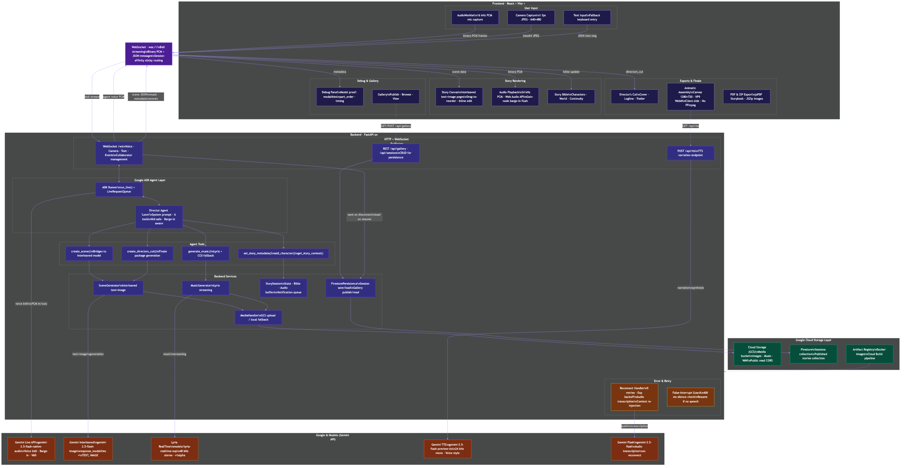

# DreamLoom — AI Creative Story Studio

**Speak your story into existence — watch narration and illustrations weave together from Gemini's native interleaved output, with atmospheric music and your AI creative director's voice guiding you in real-time.**

Not a prompt-to-page generator: Loom directs the story with taste, continuity, and live revision — like a creative partner, not a rendering engine.

Built for the [Gemini Live Agent Challenge](https://cloud.google.com/gemini/docs/live-agent-challenge) hackathon. **Category: Creative Storyteller.**

## Features

- **Voice-first interaction** — Natural conversation with Loom, your AI creative director
- **Native interleaved output** — Text + images woven together in a single Gemini API response (`response_modalities=["TEXT","IMAGE"]`)
- **Two-model architecture** — Live API for voice conversation + Gemini interleaved model for scene generation
- **Atmospheric music** — Per-scene mood-matched audio (Lyria + bundled fallback loops)
- **Camera input** — Show sketches or objects via webcam — AI incorporates them into the story
- **Director's Cut** — Cover image, logline, trailer voiceover, and animatic assembled automatically
- **Story Bible** — Live sidebar tracking characters, setting, plot threads
- **Kid-safe mode** — Family-friendly guardrails (default ON)
- **Debug panel** — "Under the Hood" view proving interleaved output (model, modalities, part order, timing)

## Tech Stack

| Layer | Technology |
|-------|-----------|
| **Voice conversation** | Gemini Live API via ADK `run_live()` |
| **Scene generation** | Gemini interleaved text+image (`response_modalities=["TEXT","IMAGE"]`) |
| **Music** | Lyria RealTime + bundled CC0 ambient loops (fallback) |
| **Backend** | FastAPI + WebSocket |
| **Agent orchestration** | Google ADK (`google-adk`) |
| **Frontend** | React + Vite + TypeScript |
| **Styling** | TailwindCSS v4 + Framer Motion |
| **Audio** | AudioWorklet (capture) + PCM playback |
| **Deployment** | Cloud Run + GCS |

## Quick Start

### Prerequisites

- Python 3.12+
- Node.js 20+
- Google AI API key ([Get one here](https://aistudio.google.com/apikey))

### Option 1: One-command local run

```bash
git clone <repo-url>
cd dreamloom
cp .env.example .env
# Edit .env and add your GOOGLE_API_KEY
./run.sh
```

### Option 2: Manual setup

```bash
# Backend
cd backend
python -m venv ../.venv
source ../.venv/bin/activate
pip install -r requirements.txt
cd ..
uvicorn backend.main:app --reload --port 8000

# Frontend (new terminal)
cd frontend
npm install
npm run dev
```

### Option 3: Docker

```bash
cp .env.example .env
# Edit .env and add your GOOGLE_API_KEY
docker compose up
# Backend: http://localhost:8000
# Frontend: http://localhost:8080
```

### Open in browser

Navigate to `http://localhost:5173` (or `:8080` with Docker) and click **Begin Your Story**.

## Cloud Deployment

### Deploy everything

Deploy both frontend and backend to Google Cloud Run with a single command:

```bash
./infra/deploy.sh YOUR_PROJECT_ID us-central1
```

This will:
1. Enable required GCP APIs
2. Create a GCS bucket for media assets
3. Build and deploy the backend to Cloud Run
4. Build and deploy the frontend to Cloud Run
5. Configure CORS and environment variables

### Deploy frontend only

If you only changed frontend code (UI, styles, components):

```bash
PROJECT_ID="your-project-id"
REGION="us-central1"
IMAGE="${REGION}-docker.pkg.dev/${PROJECT_ID}/dreamloom/frontend"

# Get the existing backend URL
BACKEND_URL=$(gcloud run services describe dreamloom-backend \
  --region="${REGION}" --project="${PROJECT_ID}" --format="value(status.url)")

# Build with backend URL baked in
cd frontend
cat > .env.production << EOF
VITE_WS_URL=${BACKEND_URL/https/wss}/ws
VITE_API_URL=${BACKEND_URL}
EOF
gcloud builds submit --tag "${IMAGE}" --project="${PROJECT_ID}" .
rm -f .env.production
cd ..

# Deploy
gcloud run deploy dreamloom-frontend \
  --image="${IMAGE}" --region="${REGION}" --project="${PROJECT_ID}" \
  --platform=managed --allow-unauthenticated --port=8080 --quiet
```

### Deploy backend only

If you only changed backend code (agents, services, API):

```bash
PROJECT_ID="your-project-id"
REGION="us-central1"
IMAGE="${REGION}-docker.pkg.dev/${PROJECT_ID}/dreamloom/backend"

gcloud builds submit --tag "${IMAGE}" --project="${PROJECT_ID}" backend/

gcloud run deploy dreamloom-backend \
  --image="${IMAGE}" --region="${REGION}" --project="${PROJECT_ID}" \
  --platform=managed --allow-unauthenticated --port=8000 \
  --memory=1Gi --cpu=2 --timeout=3600 --session-affinity --quiet
```

## Architecture



> Editable source: [`docs/architecture.mmd`](docs/architecture.mmd)

```
Browser (React + Vite + TailwindCSS + Framer Motion)
  ├── AudioWorklet → 16kHz PCM → WebSocket
  ├── Camera → 1fps JPEG → WebSocket
  ├── Story Canvas (interleaved text+image scenes) ← WebSocket
  ├── Story Bible (live sidebar) ← WebSocket
  ├── Debug Panel (model proof) ← WebSocket
  └── Director's Cut (cover + animatic) ← WebSocket
            │
      WebSocket (bidi streaming)
            │
FastAPI Backend (Cloud Run)
  └── ADK Runner + LiveRequestQueue
      └── Director Agent "Loom" (Live API — voice bidi)
          ├── create_scene() ──► SceneGenerator
          │     └── Gemini gemini-2.5-flash-image
          │        response_modalities=["TEXT","IMAGE"]
          │        → [text, image, text, image...]
          ├── generate_music() ──► MusicGenerator
          │     └── Lyria RealTime (48kHz stereo streaming)
          │        fallback → bundled CC0 loops
          ├── create_directors_cut() → finale package
          ├── set_story_metadata()
          ├── add_character()
          └── get_story_context()
            │
      Google Cloud Storage (GCS)
          └── Generated media assets (images, music)
```

### Google Cloud Services Used

| Service | Purpose |
|---------|---------|
| **Cloud Run** | Backend + frontend hosting |
| **Cloud Storage (GCS)** | Generated media asset storage |
| **Cloud Build** | Docker image builds for deployment |
| **Gemini API** | Live voice conversation + interleaved scene generation |
| **Lyria RealTime API** | AI music generation |

### Models

| Role | Model | Method |
|------|-------|--------|
| Voice conversation | `CONVERSATION_MODEL` (default: `gemini-2.5-flash-native-audio-preview-12-2025`) | ADK `run_live()` |
| Scene generation | `SCENE_MODEL` (default: `gemini-2.5-flash-image`) | `google-genai` with `response_modalities=["TEXT","IMAGE"]` |
| Music | `MUSIC_MODEL` (default: `models/lyria-realtime-exp`) | Lyria RealTime streaming + bundled CC0 fallback loops |

## Environment Variables

See `.env.example` for all options. Key variables:

```
GOOGLE_API_KEY=...          # Required
SCENE_MODEL=gemini-2.5-flash-image
CONVERSATION_MODEL=gemini-2.5-flash-native-audio-preview-12-2025
MUSIC_MODEL=models/lyria-realtime-exp
```

## Project Structure

```
├── backend/
│   ├── main.py                  # FastAPI app + WebSocket + model verification
│   ├── agents/
│   │   ├── director.py          # Director agent + Loom persona prompt
│   │   └── tools.py             # create_scene, generate_music, directors_cut, etc.
│   ├── services/
│   │   ├── scene_generator.py   # Gemini interleaved text+image generation
│   │   ├── music_generator.py   # Lyria RealTime music streaming
│   │   ├── story_state.py       # Story session state + Story Bible
│   │   └── media_handler.py     # GCS/local media storage
│   ├── config.py                # Environment config
│   └── Dockerfile
├── frontend/
│   ├── src/
│   │   ├── hooks/               # useWebSocket, useAudioCapture, useAnimatic, etc.
│   │   ├── components/          # StoryCanvas, StoryPage, StoryBible, DebugPanel, DirectorsCut
│   │   ├── App.tsx              # Main app
│   │   └── types.ts             # Type definitions
│   ├── public/audio/            # Fallback ambient loops (CC0)
│   └── Dockerfile
├── infra/
│   ├── deploy.sh                # Cloud Run deployment (automated)
│   └── setup-gcs.sh             # GCS bucket setup
├── run.sh                       # One-command local dev
├── docker-compose.yml           # Docker setup
├── DEMO_SCRIPT.md               # Reproducible demo scenarios
├── CREDITS.md                   # Audio licensing
└── README.md
```

## Demo Script

See `DEMO_SCRIPT.md` for 3 story scenarios (fantasy, sci-fi, fairy tale) with exact voice prompts to reproduce the demo experience.

## License

MIT
