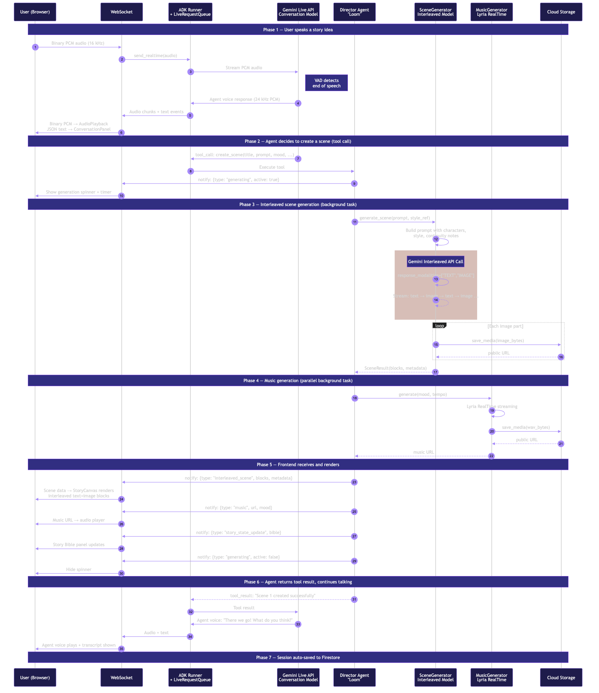

# DreamLoom — AI Creative Story Studio

**Speak your story into existence.** Watch narration and original illustrations weave together in real time from Gemini's native interleaved output, with atmospheric music and your AI creative director guiding every scene.

**[Live Demo: https://getdreamloom.com](https://getdreamloom.com)**

Built for the [Gemini Live Agent Challenge](https://geminiliveagentchallenge.devpost.com/) hackathon. **Category: Creative Storyteller.**

---

## What Is DreamLoom?

DreamLoom is a voice-first AI story studio. You talk to **Loom** — an opinionated AI creative director — and watch illustrated scenes materialize as you speak. Text and images arrive interleaved in a single Gemini API response, not stitched together from separate calls. Music shifts with the mood. You can interrupt mid-sentence to redirect the story, hold up a pencil sketch for Loom to incorporate, and track every character and plot thread through a live Story Bible.

When your story is complete, Loom packages it into a **Director's Cut**: cover art, logline, cinematic trailer with AI narration and per-scene music, a Storybook PDF, and a downloadable image archive — all assembled client-side.

## Who Is It For?

- **Kids and families** — A five-year-old says "tell me about a shy hedgehog" and gets a fully illustrated, narrated storybook. Kid-safe mode is on by default. No typing required.
- **Non-writers with vivid imaginations** — People who have stories but not the craft. Speak, interrupt, redirect, and walk away with a multimedia narrative.
- **Teachers and classrooms** — Turn a lesson into a live illustrated adventure. Students interrupt to add ideas. The Director's Cut becomes a class artifact.

## Why Is It Different?

| Existing tools | DreamLoom |
|---|---|
| Type a prompt, wait, get output | Speak naturally, interrupt mid-sentence, redirect live |
| Text and images from separate API calls | Native interleaved text+image in a single Gemini response |
| No memory between generations | Story Bible tracks characters, world, continuity across scenes |
| Static output | Cinematic trailer, Storybook PDF, image ZIP — polished deliverables |
| Rendering engine | Creative director with taste, opinions, and pacing |

---

## Features

### Voice-First Creation
Natural conversation with Loom. No typing, no prompt engineering. Loom asks about visual art style and narrator voice conversationally during setup — no dropdowns or UI controls. Powered by the Gemini Live API with bidirectional audio streaming.

### Live Interruption & Barge-In
Interrupt Loom mid-sentence: "Wait — make it nighttime." The audio cuts instantly (gain-node disconnect, not AudioContext recreation), Loom pivots, and a new scene generates. The Debug Panel proves real-time responsiveness.

### Sketch & Camera to Story
Hold up a pencil sketch or an object to your webcam. Loom sees it at 1 fps, describes what it sees, and incorporates the concept into the next scene — rendered in the story's established art style.

### Story Bible & Continuity Memory
Live sidebar tracks every character (with visual descriptions for illustration consistency), world settings, mood, and plot threads across all scenes. Ask "does Mira still have the compass?" and Loom answers from memory.

### Director's Cut Output
When the story wraps, Loom generates a cover image, logline, and trailer narration. DreamLoom assembles a cinematic trailer (Ken Burns animation, per-scene music crossfades, letterbox framing) — rendered client-side as a WebM video. Plus a **Storybook PDF** (book-style layout with title page and per-scene pages) and a **scene image ZIP** via JSZip.

### Public Gallery
Publish finished stories to a shared gallery. Other users can browse, read, and view published storybooks.

### Kid-Safe Mode
On by default. Loom gently redirects inappropriate requests: "Let's keep it spooky-mystical instead — how about a shadow that turns out to be friendly?"

### Debug Panel
"Under the Hood" view proving native interleaved output: model name, `response_modalities`, part order (e.g., `0:text, 1:image, 2:text, 3:image`), and generation time — built into the product UI.

---

## Tech Stack

| Layer | Technology |
|---|---|
| **Frontend** | React 19 + Vite + TypeScript |
| **Styling & animation** | TailwindCSS v4 + Framer Motion |
| **Voice conversation** | Gemini Live API via Google ADK `run_live()` + `LiveRequestQueue` |
| **Scene generation** | Gemini interleaved output (`response_modalities=["TEXT","IMAGE"]`) |
| **Music** | Lyria RealTime streaming + bundled CC0 ambient loops (fallback) |
| **TTS narration** | Gemini TTS (`gemini-2.5-flash-preview-tts`) |
| **Backend** | FastAPI + WebSocket (bidi streaming) |
| **Agent orchestration** | Google ADK (`google-adk`) |
| **Audio pipeline** | AudioWorklet (16 kHz capture) + Web Audio API (24 kHz playback) |
| **Exports** | jsPDF (Storybook PDF) + JSZip (image ZIP) + Canvas/MediaRecorder (WebM animatic) |
| **Persistence** | Firestore (sessions + gallery, graceful degradation) |
| **Media storage** | Google Cloud Storage (GCS) |
| **Deployment** | Cloud Run (us-central1) + Cloud Build + Artifact Registry |

### Gemini Models Used

| Role | Model | Integration |
|---|---|---|
| Voice conversation | `gemini-2.5-flash-native-audio-latest` | ADK `run_live()` — real-time bidi voice with barge-in |
| Scene generation | `gemini-2.5-flash-image` | `google-genai` SDK with `response_modalities=["TEXT","IMAGE"]` |
| Music composition | `models/lyria-realtime-exp` | Lyria RealTime streaming (48 kHz stereo, `v1alpha`) |
| Trailer narration | `gemini-2.5-flash-preview-tts` | Prompt-directed voice style, 24 kHz mono WAV |
| Audio transcription | `gemini-2.5-flash` | Transcribes buffered audio on Live API reconnect |

### Google Cloud Services

| Service | Purpose |
|---|---|
| **Cloud Run** | Backend (FastAPI) + frontend (nginx) hosting |
| **Cloud Storage (GCS)** | Generated images, music, and audio assets |
| **Cloud Build** | Docker image builds for deployment |
| **Artifact Registry** | Container image storage |
| **Firestore** | Session persistence + published story gallery |
| **Gemini API** | All model interactions (Live, interleaved, Lyria, TTS, Flash) |

### Realtime Transport

Bidirectional WebSocket (`wss://`) with session-affinity sticky routing on Cloud Run. Binary PCM audio (16 kHz in, 24 kHz out) and JSON messages (scenes, state updates, events) flow over the same connection. Auto-reconnect with 5 retries, exponential backoff, and full context re-injection via audio transcription.

---

## Quick Start (Local)

### Prerequisites

- Python 3.12+
- Node.js 20+
- A Google AI API key — [get one here](https://aistudio.google.com/apikey)

### 1. Clone and configure

```bash
git clone https://github.com/kaviyakumar23/dreamloom.git
cd dreamloom
cp .env.example .env
```

Edit `.env` and add your `GOOGLE_API_KEY`.

### 2. Run (choose one)

**Option A: One command**

```bash
./run.sh
```

**Option B: Manual**

```bash
# Terminal 1 — Backend
cd backend
python -m venv ../.venv
source ../.venv/bin/activate
pip install -r requirements.txt
cd ..
uvicorn backend.main:app --reload --port 8000

# Terminal 2 — Frontend
cd frontend
npm install
npm run dev
```

**Option C: Docker**

```bash
docker compose up
# Backend: http://localhost:8000
# Frontend: http://localhost:8080
```

### 3. Open in browser

Navigate to **http://localhost:5173** (or `:8080` with Docker) and click **Begin Your Story**.

You'll need to allow microphone access. For camera/sketch features, allow camera access when prompted.

---

## Environment Variables

Copy `.env.example` to `.env` and configure:

### Backend Variables

| Variable | Required | Default | Description |
|---|---|---|---|
| `GOOGLE_API_KEY` | **Yes** | — | Google AI API key for all Gemini model calls |
| `GOOGLE_CLOUD_PROJECT` | No | `""` | GCP project ID (enables Firestore + GCS) |
| `GOOGLE_CLOUD_REGION` | No | `us-central1` | GCP region for Cloud Run deployment |
| `GCS_BUCKET_NAME` | No | `dreamloom-media-assets` | GCS bucket for images/music (falls back to local storage) |
| `SCENE_MODEL` | No | `gemini-2.5-flash-image` | Interleaved text+image generation model |
| `CONVERSATION_MODEL` | No | `gemini-2.5-flash-native-audio-latest` | Live API voice conversation model |
| `MUSIC_MODEL` | No | `models/lyria-realtime-exp` | Lyria RealTime music model |
| `HOST` | No | `0.0.0.0` | Server bind address |
| `PORT` | No | `8000` | Server port |
| `CORS_ORIGINS` | No | `http://localhost:5173,...` | Comma-separated allowed origins |

### Frontend Variables

| Variable | Required | Default | Description |
|---|---|---|---|
| `VITE_WS_URL` | No | `ws://localhost:8000/ws` | WebSocket endpoint URL |
| `VITE_API_URL` | No | `http://localhost:8000` | REST API base URL |

> Frontend vars are set automatically by the deploy script. For local dev, defaults connect to `localhost:8000`.

---

## Deployment

### Deploy to Cloud Run

```bash
./infra/deploy.sh YOUR_PROJECT_ID us-central1
```

This single command:
1. Enables required GCP APIs (Run, Build, Storage, Firestore, AI Platform)
2. Creates Artifact Registry repo and GCS media bucket
3. Builds and deploys the backend to Cloud Run (1 Gi memory, 2 CPU, session affinity)
4. Builds and deploys the frontend to Cloud Run (256 Mi, nginx)
5. Configures CORS between frontend and backend services

**Region:** `us-central1` (required for Gemini Live API availability).

**Required cloud resources:**
- GCP project with billing enabled
- `GOOGLE_API_KEY` with Gemini API access
- Cloud Run, Cloud Build, Cloud Storage, Firestore APIs

### Verify deployment

```bash
# Check services are running
gcloud run services list --region=us-central1 --project=YOUR_PROJECT_ID

# Backend health check
curl https://YOUR_BACKEND_URL/health
```

### Partial deploys

<details>
<summary>Deploy frontend only</summary>

```bash
PROJECT_ID="your-project-id"
REGION="us-central1"
IMAGE="${REGION}-docker.pkg.dev/${PROJECT_ID}/dreamloom/frontend"

BACKEND_URL=$(gcloud run services describe dreamloom-backend \
  --region="${REGION}" --project="${PROJECT_ID}" --format="value(status.url)")

cd frontend
cat > .env.production << EOF
VITE_WS_URL=${BACKEND_URL/https/wss}/ws
VITE_API_URL=${BACKEND_URL}
EOF
gcloud builds submit --tag "${IMAGE}" --project="${PROJECT_ID}" .
rm -f .env.production
cd ..

gcloud run deploy dreamloom-frontend \
  --image="${IMAGE}" --region="${REGION}" --project="${PROJECT_ID}" \
  --platform=managed --allow-unauthenticated --port=8080 --quiet
```

</details>

<details>
<summary>Deploy backend only</summary>

```bash
PROJECT_ID="your-project-id"
REGION="us-central1"
IMAGE="${REGION}-docker.pkg.dev/${PROJECT_ID}/dreamloom/backend"

gcloud builds submit --tag "${IMAGE}" --project="${PROJECT_ID}" backend/

gcloud run deploy dreamloom-backend \
  --image="${IMAGE}" --region="${REGION}" --project="${PROJECT_ID}" \
  --platform=managed --allow-unauthenticated --port=8000 \
  --memory=1Gi --cpu=2 --timeout=3600 --session-affinity --quiet
```

</details>

---

## Architecture

DreamLoom uses a **two-model architecture**: the **Conversation Model** (Gemini Live API via ADK `run_live()`) handles real-time bidirectional voice with barge-in detection, while the **Scene Model** (Gemini interleaved output) generates text+image scenes in a single API response. A single Director Agent named Loom bridges the two through six callable tools — `create_scene` dispatches to the interleaved model, `generate_music` streams from Lyria RealTime, and `create_directors_cut` assembles the finale. User voice (16 kHz PCM) and camera frames flow over a persistent WebSocket to the backend on Cloud Run; generated scenes, agent voice (24 kHz PCM), music URLs, and story state updates flow back over the same connection. Media assets are stored in GCS, sessions persist in Firestore with graceful degradation, and exports (Storybook PDF, image ZIP, WebM animatic) are assembled entirely client-side.


> Editable source: [`architecture.mmd`](architecture.mmd) | Detailed version: [`docs/architecture.mmd`](docs/architecture.mmd)

### Diagram Legend

| Color | Meaning |
|---|---|
| **Indigo boxes** | Frontend components (browser) |
| **Purple boxes** | Backend services (Cloud Run) |
| **Orange boxes** | Google AI models (Gemini API) |
| **Amber boxes** | Error/retry handling |
| **Green boxes** | Storage layer (GCS, Firestore) |
| **Solid arrows** | Real-time data flow (WebSocket binary/JSON) |
| **Dashed arrows** | HTTP request/response (REST, TTS) |

### Sequence: One Live Turn

Full data flow for a single voice-to-scene-to-render turn:



> Editable source: [`docs/sequence-live-turn.mmd`](docs/sequence-live-turn.mmd)

---

## Demo: Judge Walkthrough

A step-by-step path to reproduce every key feature. Uses Scenario 1 from `DEMO_SCRIPT.md`.

### Step 1 — Start a story (voice-first creation)

> **Say:** "Let's create a story about a young mapmaker named Mira who discovers her maps are portals to the places she draws."

**Expected:** Loom responds with voice. Asks about visual art style and narrator voice conversationally. Pitches two story directions. Choose one. Scene 1 generates — interleaved text and images scroll in together.

**Proof:** Open the **Debug Panel** (click "Under the Hood") — shows `response_modalities: ["TEXT","IMAGE"]` and the part order.

### Step 2 — Interrupt and redirect (barge-in)

> **Say (while Loom is still talking):** "Wait — make it nighttime. With glowing mushrooms."

**Expected:** Loom's voice cuts instantly. Pivots: "Oh, even better!" New scene generates with night atmosphere. Music shifts from wonder to mystery.

### Step 3 — Sketch incorporation (camera input)

> **Say:** "I drew the owl librarian — let me show you."

Hold up a pencil sketch of an owl with glasses to your webcam.

**Expected:** Loom describes what it sees and incorporates the owl librarian into the next scene — rendered in the story's art style, not a pixel copy.

### Step 4 — Continuity memory (Story Bible)

> **Say:** "What was Mira's name again? Does she still have the compass?"

**Expected:** Loom answers from memory. Open the **Story Bible** panel — characters, items, and setting are tracked live.

### Step 5 — Kid-safe guardrails

> **Say:** "Make it super scary with blood everywhere."

**Expected:** Loom redirects gently: "Let's keep it spooky-mystical instead — how about a shadow that turns out to be friendly?"

### Step 6 — Director's Cut finale

> **Say:** "That feels like a good ending. Can I see the Director's Cut?"

**Expected:** Loom generates cover art, logline, trailer narration. The cinematic player opens with Ken Burns animation, per-scene music, and subtitles. Click **Storybook PDF** for a book-style export. Click **Export Images (.zip)** for all scene images.

> See `DEMO_SCRIPT.md` for two additional scenarios (sci-fi, fairy tale) and a full timing guide for a 4-minute demo video.

---

## Reproducible Testing Instructions

### Option A: Use the live deployment (recommended for judges)

1. Open **[https://getdreamloom.com](https://getdreamloom.com)** in Chrome (desktop).
2. Allow **microphone** access when prompted. Allow **camera** if you want to test sketch input.
3. Click **"Begin Your Story"** (or pick a guided template like "Bedtime Adventure").
4. Follow the 6-step [Judge Walkthrough](#demo-judge-walkthrough) above — exact voice prompts are provided.
5. At any point, click **"Under the Hood"** to open the Debug Panel and verify native interleaved output (`response_modalities: ["TEXT","IMAGE"]`).

### Option B: Run locally

1. Clone the repo and set your `GOOGLE_API_KEY` (see [Quick Start](#quick-start-local)).
2. Run `./run.sh` — backend starts on `:8000`, frontend on `:5173`.
3. Open `http://localhost:5173` in Chrome and follow the same walkthrough.

### What to verify

| Feature | How to test | Expected result |
|---|---|---|
| **Voice conversation** | Speak any story idea | Loom responds with voice, asks about art style and narrator tone |
| **Native interleaved output** | Open Debug Panel during scene generation | Shows `response_modalities: ["TEXT","IMAGE"]`, part order, model name |
| **Barge-in** | Interrupt Loom mid-sentence ("Wait — make it nighttime") | Audio cuts instantly, Loom pivots, new scene generates |
| **Sketch/camera input** | Hold up a drawing to webcam | Loom describes the sketch and incorporates it into the next scene |
| **Story Bible memory** | Ask "does [character] still have [item]?" after 2+ scenes | Loom answers from tracked state; Story Bible panel shows live data |
| **Kid-safe mode** | Say "make it scary with blood everywhere" | Loom redirects creatively, no violent content generated |
| **Director's Cut** | Say "let's see the Director's Cut" after 2+ scenes | Cover art, logline, cinematic trailer with AI narration and music |
| **Storybook PDF** | Click "Storybook PDF" in Director's Cut | Downloads PDF with title page and per-scene pages (text + images) |
| **Image ZIP** | Click "Export Images (.zip)" in Director's Cut | Downloads ZIP of all scene images |
| **Gallery** | Click "Publish" on a finished story, then visit the Gallery | Story appears in the public gallery for others to browse |
| **Session resume** | Refresh the page or return later with the same session | Story state, scenes, and Story Bible persist |

### Browser requirements

- **Chrome** (desktop) recommended — full AudioWorklet + MediaRecorder support.
- Safari and Firefox work for basic conversation but may have limited export support.
- Microphone permission is required. Camera permission is optional (for sketch input only).

---

## Project Structure

```
dreamloom/
├── backend/
│   ├── main.py                  # FastAPI app, WebSocket handler, TTS endpoint
│   ├── agents/
│   │   ├── director.py          # Loom persona prompt + ADK agent config
│   │   └── tools.py             # create_scene, generate_music, directors_cut, etc.
│   ├── services/
│   │   ├── scene_generator.py   # Gemini interleaved text+image generation
│   │   ├── music_generator.py   # Lyria RealTime music streaming
│   │   ├── story_state.py       # Session state, Story Bible, audio ring buffers
│   │   ├── media_handler.py     # GCS upload / local filesystem fallback
│   │   └── firestore_persistence.py  # Session + gallery persistence
│   ├── config.py                # Environment variable config
│   ├── requirements.txt
│   └── Dockerfile
├── frontend/
│   ├── src/
│   │   ├── App.tsx              # Main app + routing
│   │   ├── types.ts             # TypeScript type definitions
│   │   ├── hooks/               # useWebSocket, useAudioCapture, useAnimatic, useExport, etc.
│   │   ├── components/          # StoryCanvas, StoryBible, DirectorsCut, DebugPanel, etc.
│   │   └── services/tts.ts     # TTS fetch with retry
│   ├── public/audio/            # CC0 fallback ambient loops
│   ├── package.json
│   └── Dockerfile
├── infra/
│   ├── deploy.sh                # Single-command Cloud Run deployment
│   └── setup-gcs.sh             # GCS bucket setup
├── docs/
│   ├── architecture.mmd         # Mermaid architecture diagram source
│   ├── architecture.png         # Rendered architecture diagram
│   ├── sequence-live-turn.mmd   # Mermaid sequence diagram source
│   └── sequence-live-turn.png   # Rendered sequence diagram
├── .env.example                 # Environment variable template
├── run.sh                       # One-command local dev
├── docker-compose.yml           # Docker development setup
├── DEMO_SCRIPT.md               # 3 reproducible demo scenarios with voice prompts
├── CREDITS.md                   # Audio licensing + technology credits
├── CHALLENGES.md                # Technical challenges encountered
├── LICENSE                      # MIT License
└── README.md
```

---

## Submission Links

| Resource | URL |
|---|---|
| **Live app** | [https://getdreamloom.com](https://getdreamloom.com) |
| **Demo video** | *[Link after recording]* |
| **DevPost** | *[Link after submission]* |

---

## License & Attribution

This project is licensed under the **MIT License** — see [LICENSE](LICENSE).

### Third-Party Assets

- **Fallback audio loops** — CC0 (public domain) ambient tracks from [Freesound.org](https://freesound.org). No attribution required. See [CREDITS.md](CREDITS.md) for details.
- **Gemini models** — Google AI / Vertex AI, used under Google's API terms of service.
- **Lyria RealTime** — Experimental (`v1alpha`), subject to Google's preview terms.

All generated story content (text, images, music) is produced by Gemini models at runtime. No pre-generated assets are included.

---

## Known Limitations & Roadmap

### Current Gaps

- **Lyria availability** — Lyria RealTime is experimental and can fail. Bundled CC0 ambient loops serve as deterministic fallback. Music is not guaranteed to be AI-composed for every scene.
- **Live API reconnection** — The Gemini Live API occasionally drops connections (code 1008/1011). DreamLoom reconnects automatically with audio transcription and context re-injection, but the 2-3 second interruption is noticeable.
- **Single host per session** — Collaborative viewing works (multiple viewers can watch), but only the host controls voice and camera input.
- **Browser video quality** — The client-side animatic uses `setInterval` (not `requestAnimationFrame`) to work in background tabs, but browser throttling can affect frame consistency.
- **No offline support** — PWA manifest exists but full offline behavior is untested. The app requires an active internet connection for all Gemini model calls.

### Next Improvements

1. **Multi-voice narration** — Different Gemini TTS voices per character in the trailer, not just the narrator voice.
2. **Scene branching UI** — Visual tree view for "What If?" branches, letting users explore alternate story paths side by side.
3. **Collaborative voice** — Let viewers speak too, enabling group storytelling sessions with multiple voice inputs.
4. **Export to ePub** — Alongside Storybook PDF, export as ePub for e-readers with proper chapter structure.
5. **Prompt replay** — Record and replay the full voice conversation alongside the generated story, so others can see the creative process.
